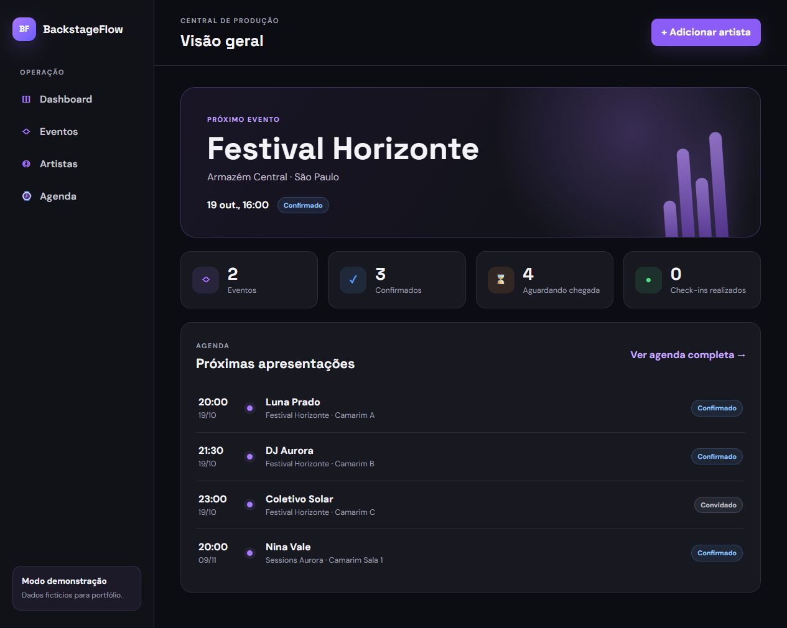
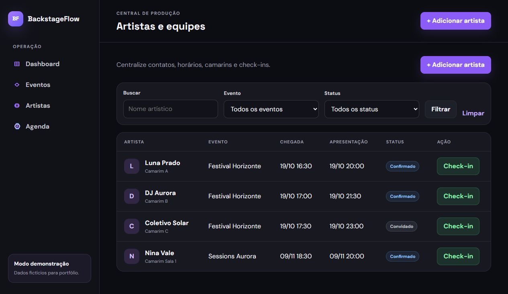

# BackstageFlow

Sistema web para organizar a operação de artistas em eventos. O projeto centraliza horários de chegada, apresentações, contatos, camarins, transporte, hospitalidade e check-in em uma interface responsiva.

> Projeto de portfólio inspirado em rotinas reais de produção de eventos. Todos os eventos, artistas e contatos incluídos na demonstração são fictícios.

## Capturas de tela

Capturas da aplicação executada localmente com os dados fictícios de demonstração.

### Dashboard



### Artistas e equipes



## Funcionalidades

- Dashboard com indicadores da operação e próximas apresentações
- Cadastro, edição, visualização e exclusão de eventos
- Cadastro completo de artistas e equipes
- Filtros por evento, status e nome artístico
- Agenda agrupada por dia e ordenada por apresentação
- Check-in de artistas com regras de negócio
- Controle de status: convidado, confirmado, chegou, em apresentação, concluído ou cancelado
- Banco SQLite criado e populado automaticamente na primeira execução
- Layout responsivo para desktop, tablet e celular
- Testes unitários com xUnit e cobertura com Coverlet
- Pipeline de integração contínua com GitHub Actions
- Execução local ou com Docker

## Tecnologias

- C# 14 e .NET 10
- ASP.NET Core MVC e Razor Views
- Entity Framework Core 10
- SQLite
- HTML5 e CSS3 responsivo
- xUnit
- Docker e Docker Compose
- GitHub Actions

## Arquitetura

```text
BackstageFlow/
├── src/BackstageFlow.Web/
│   ├── Controllers/      # Entrada das requisições e casos de uso
│   ├── Data/             # DbContext e carga de dados fictícios
│   ├── Models/           # Entidades e regras de negócio
│   ├── ViewModels/       # Dados específicos das telas
│   ├── Views/            # Interface Razor MVC
│   └── wwwroot/css/      # Identidade visual responsiva
├── tests/BackstageFlow.Tests/
├── .github/workflows/ci.yml
├── Dockerfile
└── docker-compose.yml
```

O fluxo segue o padrão MVC: o navegador envia a ação ao `Controller`, o controller consulta ou altera os dados pelo `AppDbContext` e devolve uma `View` Razor. As regras de check-in ficam no modelo `ArtistBooking`, o que facilita os testes unitários.

## Como executar

### Pré-requisitos

- [.NET SDK 10](https://dotnet.microsoft.com/download/dotnet/10.0)
- Git

### Terminal

```bash
git clone https://github.com/jmmedeiross/backstageflow-mvc.git
cd backstageflow-mvc
dotnet restore BackstageFlow.slnx
dotnet test BackstageFlow.slnx
dotnet run --project src/BackstageFlow.Web
```

Acesse `http://localhost:5090`. O banco `backstageflow.db` será criado automaticamente e receberá dados fictícios para demonstração.

### Docker

```bash
docker compose up --build
```

Acesse `http://localhost:5090`. O volume `backstageflow-data` preserva o banco entre reinicializações.

## Testes

```bash
dotnet test BackstageFlow.slnx --collect:"XPlat Code Coverage"
```

Os testes cobrem o check-in, os status que impedem a chegada e a preservação do histórico durante a apresentação.

## Decisões técnicas

- **MVC com Razor:** entrega backend e frontend no mesmo projeto, mantendo o escopo adequado para um portfólio júnior.
- **SQLite:** permite testar o sistema sem configurar um servidor de banco de dados.
- **Regras no domínio:** o modelo impede check-in de artistas cancelados ou com operação concluída.
- **Dados iniciais:** tornam a interface demonstrável logo após executar o projeto.
- **CI:** cada push na branch `main` restaura, compila e testa a solução.

## Próximas evoluções

- Autenticação e perfis de acesso
- Histórico de alterações por artista
- Exportação da agenda em PDF
- Notificações de atraso
- Testes de integração dos controllers

## Autor

Desenvolvido por [João Medeiros](https://www.linkedin.com/in/jmmedeiross/) como projeto de portfólio para desenvolvimento backend .NET.

## Licença

Distribuído sob a licença MIT.
